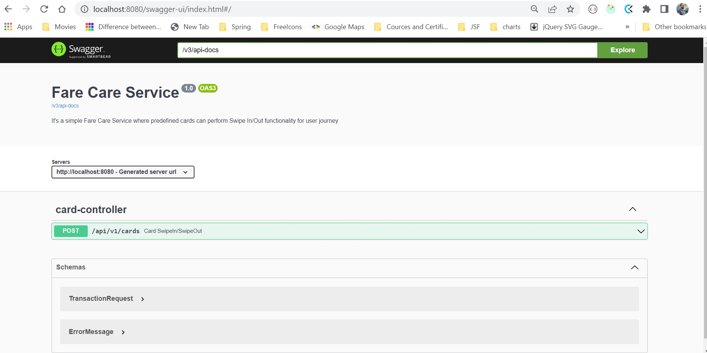
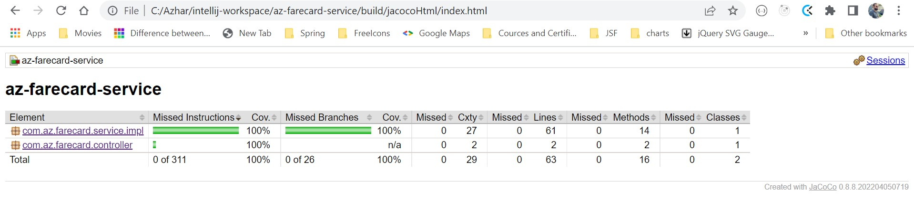
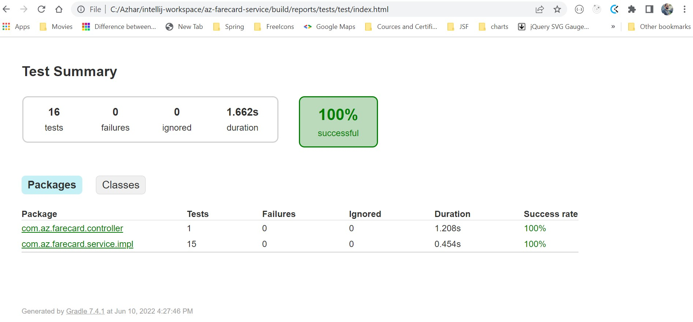
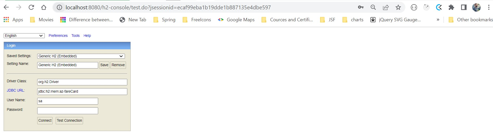
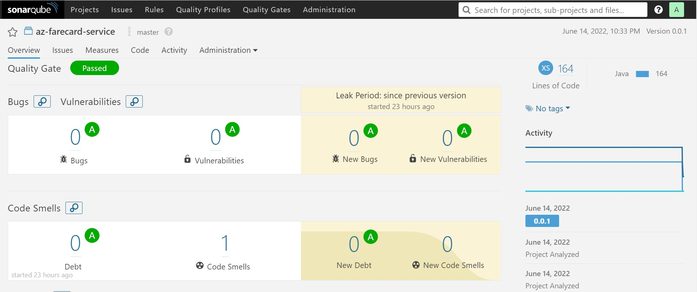
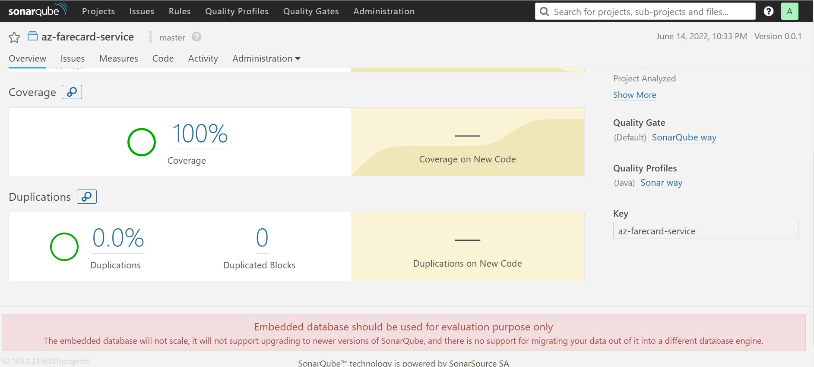

### Az-FareCard-Service

#### Requirements:
You are required to model the following fare card system which is a limited version of
London’s Oyster card system. At the end of the test, you should be able to demonstrate a
user loading a card with £30, and taking the following trips, and then viewing the balance.
- Tube Holborn to Earl’s Court
- 328 bus from Earl’s Court to Chelsea
- Tube Earl’s court to Hammersmith

##### Additionally
* All bus journey doesn't belong to any zone.
* If User start his journey at zone 1 and end his journey at zone 2 it means two zones.
* If User start his journey at zone 1 and end his journey at zone 3 it means three zones.
* Other than bus journey we need to deduct 3.20 max fare in advanced if user will not do swipe-out at the end of journey he will be charges with max fare.
* In Bus journey max fare would be 1.80 in both cases user swipe-out or not swipe-out.
>Stations and zones:

| Stations  | Zones |
|-----------|-------|
| Holborn   | 1     |
| Earl’s Court   | 1,2   |
| Wimbledon   | 3     |
| Hammersmith   | 2     |
> Fares:

| Journey      | Fare |
|--------------|------|
| Anywhere in Zone 1      | £2.50    |
| Any one zone outside zone 1 | £2.00  |
| Any two zones including zone 1    | £3.00    |
| Any two zones excluding zone 1  | £2.25    |
|Any three zones|£3.20|
|Any bus journey|£1.80|

#### Technologies:
- Java8
- Spring Boot
- Spring Data JPA
- H2 DB
- Spring Doc open API
- Gradle project
- JUnit 5
- JaCoCo
- Docker

#### How to run
##### Run as a Docker
###### Build Docker image
* Run below command:
```
./gradlew bootBuildImage --imageName=az-farecard-service
```
###### Run Docker image
```
docker run -p 8080:8080 az-farecard-service
```
###### Run without Docker
```
./gradlew clean build bootRun
```
###### Code coverage report
* Make sure SonarQube server up and running or execute below command
```
docker run -d --name sonarqube -e SONAR_ES_BOOTSTRAP_CHECKS_DISABLE=true -p 9000:9000 sonarqube:6.7.5
```
* Please validate [SonarQube server up](http://localhost:9000/)
* Default username/password admin/admin
* Please run below command to check SonarQube report
```
./gradlew clean build sonarqube
```

#### How to use:
* Limiting the scope of requirements I have inserted some cards with initial balance in DB by `data.sql`.
* In resources folder I have added `schema.sql` and `data.sql` for DB and predefined cards.
* There are four cards available for testing with `cardId` would be one of [1,2,3,4].
* Limiting the scope of requirements I'm assuming there will be only three zones so `zoneId` would be one of [0,1,2,3]
* You can easily test whole application with `swagger-ui`.
#### Useful links (after running application):
* [Swagger url](http://localhost:8080/swagger-ui/index.html)
* [H2 Console](http://localhost:8080/h2-console)
* [TDD-Reports](build/jacocoHtml/index.html)
#### Use-Cases
##### Use-Case-1  [Anywhere in Zone 1 (fare=2.50)]:
* User swipeIn his card from zone 1 and backend API will be triggered with below request:
```
{
  "cardId":1,
  "zoneId": 1,
  "swipeType": "IN"
}
```
* In the response you will get remaining balance:
```
26.8
```
* User swipeOut his card with in zone 1 then:
Request
```
{
  "cardId":1,
  "zoneId": 1,
  "swipeType": "OUT"
}
```
Response
```
27.50
```
##### Use-Case-2  [Any one zone outside zone 1 (Fare = 2.00)]:
* User swipeIn his card from zone 2 and backend API will be triggered with below request:
```
{
  "cardId":1,
  "zoneId": 2,
  "swipeType": "IN"
}
```
* In the response you will get remaining balance:
```
26.8
```
* User swipeOut his card with in zone 2 then:
  Request
```
{
  "cardId":1,
  "zoneId": 2,
  "swipeType": "OUT"
}
```
Response
```
28
```
##### Use-Case-3  [Any two zones including zone 1 (Fare = 3.00)]:
* User swipeIn his card from zone 1 and backend API will be triggered with below request:
```
{
  "cardId":1,
  "zoneId": 1,
  "swipeType": "IN"
}
```
* In the response you will get remaining balance:
```
26.8
```
* User swipeOut his card with in zone 2 then:
  Request
```
{
  "cardId":1,
  "zoneId": 2,
  "swipeType": "OUT"
}
```
Response
```
27
```
##### Use-Case-4  [Any two zones excluding zone 1 (Fare = 2.25)]:
* User swipeIn his card from zone 2 and backend API will be triggered with below request:
```
{
  "cardId":1,
  "zoneId": 2,
  "swipeType": "IN"
}
```
* In the response you will get remaining balance:
```
26.8
```
* User swipeOut his card with in zone 3 then:
  Request
```
{
  "cardId":1,
  "zoneId": 3,
  "swipeType": "OUT"
}
```
Response
```
27.75
```
##### Use-Case-5  [Any three zones (Fare = 3.20)]:
* User swipeIn his card from zone 1 and backend API will be triggered with below request:
```
{
  "cardId":1,
  "zoneId": 1,
  "swipeType": "IN"
}
```
* In the response you will get remaining balance:
```
26.8
```
* User swipeOut his card with in zone 3 then:
  Request
```
{
  "cardId":1,
  "zoneId": 3,
  "swipeType": "OUT"
}
```
Response
```
26.8
```
##### Use-Case-6  [Any bus journey (Fare = 1.80)]:
* User swipeIn his card from zone 0 (because all bus journey doesn't belong to any zone) and backend API will be triggered with below request:
```
{
  "cardId":1,
  "zoneId": 0,
  "swipeType": "IN"
}
```
* In the response you will get remaining balance:
```
28.2
```
* User swipeOut his card with in zone 1 then:
  Request
```
{
  "cardId":1,
  "zoneId": 0,
  "swipeType": "OUT"
}
```
Response
```
28.2
```

#### Plus points:
* TDD reporting with the help of `JaCoCo`.
* `SonarQube` plugin also configured for Code quality, coverage , vulnerabilities and many more.
* `Docker` Image, so we can easily build, ship and deploy.
* `Swagger-UI`, Spring doc open API configured so that we can use swagger-UI for testing purpose.
* `@EnableJpaAuditing`, Spring Data JPA Auditing is active.

#### Useful screenshot:







#### Improvement points:
* Zone and stations should come from DB dynamically, right now I have hardcoded.
* We should have authentication and authorization for accessing endpoints.
* We should have `UserController` OR user endpoint for login and registration purpose.
* We should link cards with Customers on top customers registration.
* Then after we should have spring-security with JTW token base authentication & authorization.
* We should use `Drools` for fare rules. So we don't need to hard code rules by if-else wise.
* Right Spring data jpa auditing implemented half some more fields still needs to cover.
